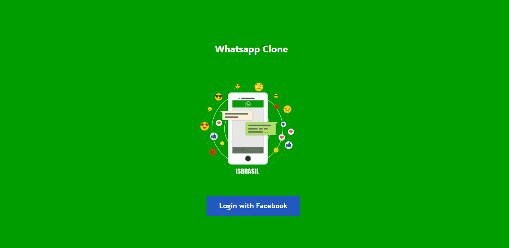

# Whatsapp Clone

## Adaptado por Gabriel Rodrigues

 

## Scripts Disponíveis

No diretório do projeto, você pode executar:

### `yarn start`

Executa o aplicativo no modo de desenvolvimento.  
Abra [http: // localhost: 3000] (http: // localhost: 3000) para visualizá-lo no navegador.

A página será recarregada se você fizer edições.  
Você também verá quaisquer erros de lint no console.

### `yarn test`

Inicia o executor de teste no modo de observação interativo.  
Consulte a seção sobre [testes em execução] (https://facebook.github.io/create-react-app/docs/running-tests) para obter mais informações.

### `yarn build`

Compila o aplicativo para produção na pasta `build`.  
Ele agrupa corretamente o React no modo de produção e otimiza a construção para o melhor desempenho.

A compilação é reduzida e os nomes dos arquivos incluem os hashes.  
Seu aplicativo está pronto para ser implantado!

Consulte a seção sobre [implantação] (https://facebook.github.io/create-react-app/docs/deployment) para obter mais informações.

### `yarn eject`

** Nota: esta é uma operação unilateral. Depois de `ejetar`, você não pode mais voltar! **

Se você não estiver satisfeito com a ferramenta de construção e as opções de configuração, você pode `ejetar` a qualquer momento. Este comando removerá a dependência única de compilação de seu projeto.

Em vez disso, ele copiará todos os arquivos de configuração e as dependências transitivas (webpack, Babel, ESLint, etc) diretamente para o seu projeto para que você tenha controle total sobre eles. Todos os comandos, exceto `eject`, ainda funcionarão, mas eles apontarão para os scripts copiados para que você possa ajustá-los. Neste ponto, você está sozinho.

Você não precisa usar `ejetar`. O conjunto de recursos selecionados é adequado para implantações pequenas e médias, e você não deve se sentir obrigado a usar esse recurso. No entanto, entendemos que esta ferramenta não seria útil se você não pudesse personalizá-la quando estiver pronto para ela.

## Saber mais

Você pode aprender mais na [documentação do aplicativo Criar React] (https://facebook.github.io/create-react-app/docs/getting-started).

Para aprender o React, verifique a [documentação do React] (https://reactjs.org/).

### Divisão de Código

Esta seção mudou para aqui: https://facebook.github.io/create-react-app/docs/code-splitting

### Analisando o tamanho do pacote

Esta seção mudou para aqui: https://facebook.github.io/create-react-app/docs/analyzing-the-bundle-size

### Fazendo um Progressive Web App

Esta seção foi movida para aqui: https://facebook.github.io/create-react-app/docs/making-a-progressive-web-app

### Configuração avançada

Esta seção mudou para aqui: https://facebook.github.io/create-react-app/docs/advanced-configuration

### Desdobramento, desenvolvimento

Esta seção mudou para aqui: https://facebook.github.io/create-react-app/docs/deployment

### `yarn build` falha ao minificar

Esta seção foi movida para aqui: https://facebook.github.io/create-react-app/docs/trou troubleshooting#npm-run-build-fails-to-minify